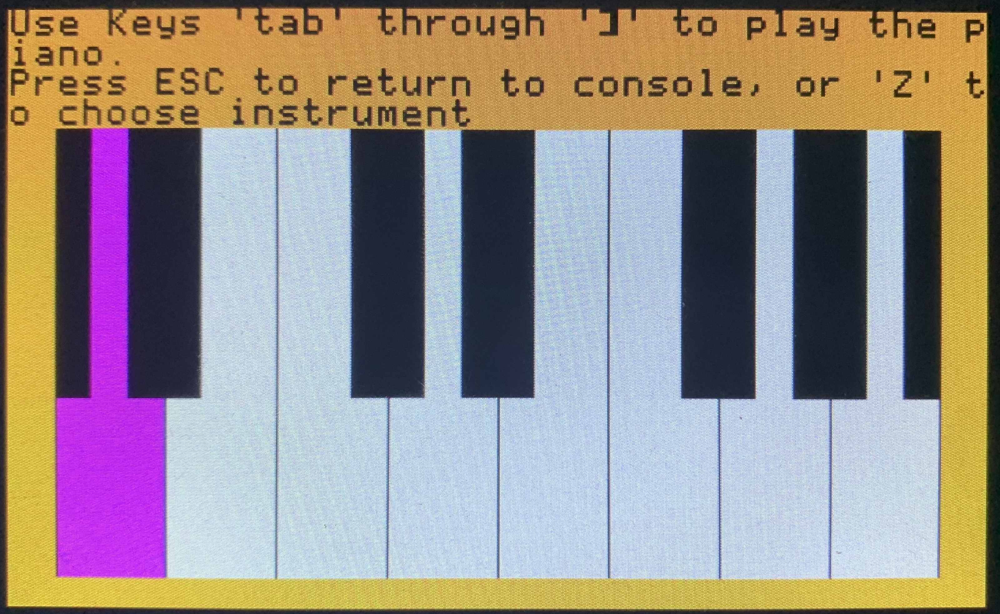
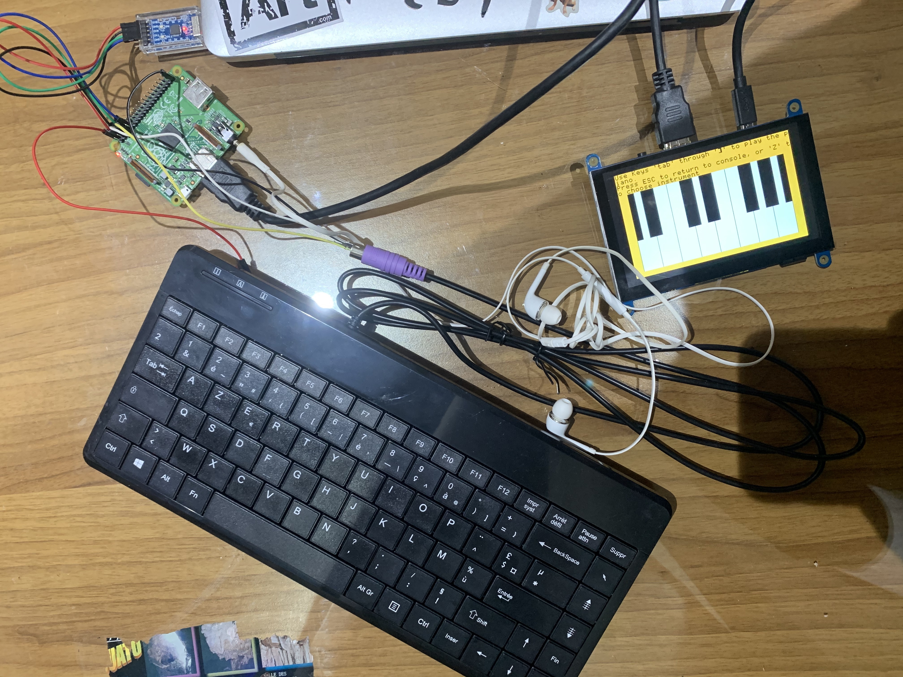

# Computer Architecture using Raspberry Pi 

This repository contains an overview of what I learned while auditing Stanford's class on Computer Systems. Code is available upon request. 

## The Course Content 

- ARM architecture and machine code
- From Assembly to C code 
- Communication and the Serial Protocol 
- Modules, libraries and linking 
- Memory Management 
- Keyboards and the PS/2 Protocol 
- Sound, Analog, and Music 
- Interrupts 
- Computer Arithmetics 

## Assignments 

Parallel to the courses were assignments, which aimed to build a computer system from the grounds up: 
- Assignment 1: Implement a Larson Scanner
- Assignment 2: Implement a Clock 
- Assignment 3: Implement a String Formatting Library 
- Assignment 4: Backtrace and Malloc 
- Assignment 5: Keyboard and Simple Shell 
- Assignment 6: Graphics Library and Console 
- Assignment 7: System Monitor with Interrupts 

## Final Project: A Musical Keyboard and Shell 

There was also a final project, which was to be chosen freely within teams. My team chose to implement a musical keyboard with a graphic interface and shell. 

### Project description
We aim to make a musical piano keyboard, where we could play the 12 keys of one octave on specific keys of the keyboard. We extended the shell that we built during the previous assignments by adding a `music` command which boots the console into a piano graphical interface, and interprets certain keystrokes as piano keys, playing sounds according to which instrument synth the user chooses. The program returns to normal shell function with the 'ESC' key, and a instrument synth can be choosen using the 'Z' key.

### An overview of the functionalities

When the user presses a key, the corresponding key is highlighted in the graphical interface (corresponding to a piano keyboard)

The shell, with the added 'music' command.

Once the musical keyboard is started, the user can choose an instrument 

And here is what the hardware setup looked like 

